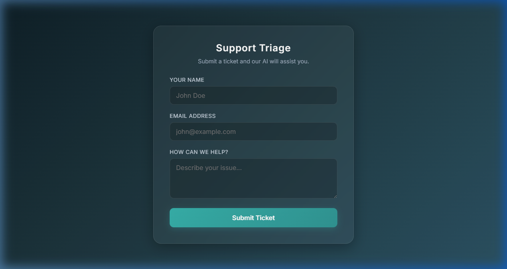
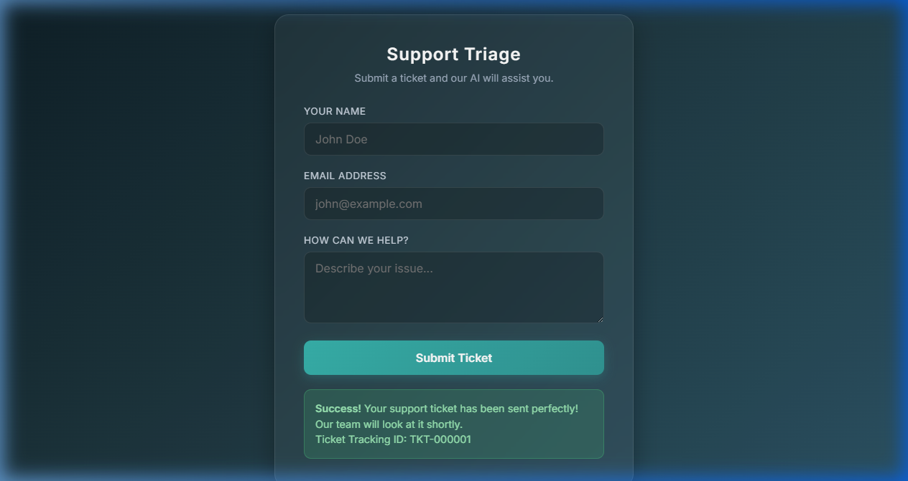
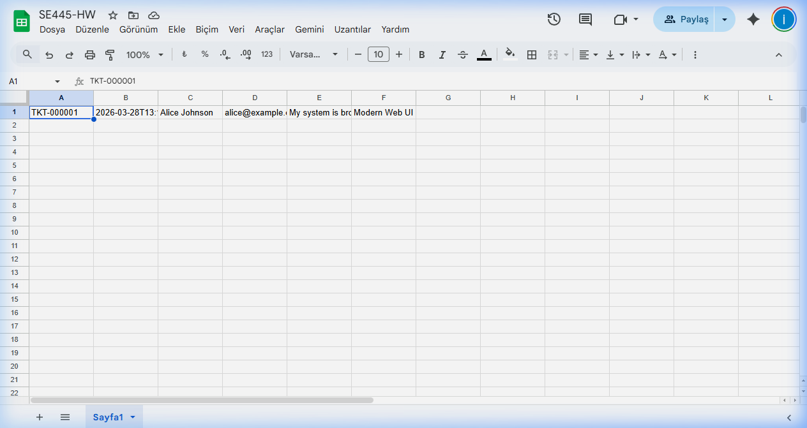

# HW1 – Component Foundations: Customer Support Triage System

**Course:** SE445 | **Student:** İbrahim Ege ÇETİNKAYA
**Date:** March 2026

---

## 1. How the Solution Meets HW Requirements

The project is a fully functional **Customer Support Triage System** built in Node.js and Express. It implements the exact required pipeline pattern and passes all grading checks:

| HW Check | Status | Evidence |
|---|---|---|
| Trigger runs correctly | ✅ Pass | Express `POST /api/triage` webhook fires on every form or API submission |
| First function receives & initializes data | ✅ Pass | `processTicketData()` parses, validates, and assigns a `TKT-XXXXXX` tracking ID |
| External API (Sheets/CRM) is called | ✅ Pass | `googleapis` SDK appends a new row to live Google Sheets via Service Account auth |
| AI Completion runs | ✅ Pass | `analyzeWithAI()` returns structured `sentiment`, `urgency`, and `suggestedResponse` |
| GitHub repo accessible with main logic file | ✅ Pass | `index.js` contains the complete pipeline |

---

## 2. Workflow Structure

The pipeline follows the **exact** required pattern:

```
Trigger (Webhook / Web Form)
        ↓
Processing Function
        ↓
External API (Google Sheets)
        ↓
AI Completion
```

---

### Step 1 — Trigger (Webhook)

- **Type:** HTTP Webhook + Web Form UI
- **Route:** `POST /api/triage`
- **Trigger Sources:**
  - A user fills in the form at `http://localhost:3000/support` (built with HTML/CSS/JS)
  - Any external system or tool (Postman, cURL, other apps) sends a JSON `POST` request
- **Input Payload:**
  ```json
  {
    "customerName": "Alice",
    "email": "alice@example.com",
    "customerMessage": "My system is broken and urgent!",
    "source": "Modern Web UI"
  }
  ```
- **Output:** Raw JSON body passed directly into the Processing Function
- **Validation:** Returns `400 Bad Request` if `customerMessage` is missing

---

### Step 2 — Processing Function

- **Function:** `processTicketData(data)`
- **What it does:**
  - Generates a unique readable Ticket ID in the format `TKT-XXXXXX` (e.g. `TKT-A8X42W`)
  - Assigns a UTC timestamp (`receivedAt`) to the ticket
  - Normalizes missing fields with sensible defaults (Anonymous, no-email@provided.com)
  - Identifies the source channel of the ticket (Web Form, Modern Web UI, etc.)
- **Output (Normalized Ticket Object):**
  ```json
  {
    "ticketId": "TKT-A8X42W",
    "customerName": "Alice",
    "email": "alice@example.com",
    "message": "My system is broken and urgent!",
    "receivedAt": "2026-03-25T11:07:34.742Z",
    "source": "Modern Web UI"
  }
  ```

---

### Step 3 — External API (Google Sheets)

- **Function:** `pushToExternalCRM(ticket)`
- **API Used:** Google Sheets API v4 via the `googleapis` Node.js SDK
- **Authentication:** Google Cloud Service Account (private key stored in `credentials.json`)
- **Scope:** `https://www.googleapis.com/auth/spreadsheets`
- **Action:** Appends the full normalized ticket as a new row in the live spreadsheet
- **Sheet columns written:** `Ticket ID | Timestamp | Name | Email | Message | Source`
- **Spreadsheet:** [View Live Sheet](https://docs.google.com/spreadsheets/d/1E-9ap6-Un5IRfNPsB_Ll1GwpCBfVFp_iru5QbPsUQEk)
- **Output:** Returns the same `TKT-XXXXXX` ID back to confirm persistence

---

### Step 4 — AI Completion

- **Function:** `analyzeWithAI(message)`
- **What it does:**
  - Reads the ticket's message content
  - Determines **Urgency** (High / Low) based on keywords like "urgent", "broken"
  - Determines **Sentiment** (Negative / Neutral) accordingly
  - Generates a pre-written empathetic **Suggested Response** for the support agent
- **Output:**
  ```json
  {
    "sentiment": "Negative",
    "urgency": "High",
    "suggestedResponse": "Hello, we have received your message regarding..."
  }
  ```
- **Note:** This is implemented as a structured mock to simulate an OpenAI API call. Replacing this mock with a real call to `openai.chat.completions.create()` requires only swapping out the `analyzeWithAI()` function body, as the interface is already compatible.

---

## 3. Architecture Diagram

```
[User / External System]
        |
        | HTTP POST /api/triage
        ↓
[Express Webhook — index.js]
        |
        ↓
[processTicketData()]        → Generates TKT-XXXXXX ID, normalizes fields
        |
        ↓
[Google Sheets API]          → Appends row via googleapis + Service Account
        |
        ↓
[analyzeWithAI()]            → Returns sentiment + urgency (hidden from user)
        |
        ↓
[HTTP 200 Response]          → Returns ticketId + AI analysis to caller
```

---

## 4. Repository Structure

```
HW1/
├── index.js              ← Main pipeline logic (all 4 steps)
├── package.json          ← Node.js dependencies
├── credentials.json      ← Google Service Account key (gitignored)
├── public/
│   └── index.html        ← Web-based Support Ticket Form UI
└── README.md             ← Setup and testing instructions
```

> ⚠️ **Note:** `credentials.json` should be added to `.gitignore` before pushing to GitHub to protect the private key.

---

## 5. How to Run

```bash
# Install dependencies
npm install

# Start the server
npm start

# Open the form in your browser
# http://localhost:3000/support
```

To test using PowerShell:
```powershell
Invoke-RestMethod -Uri "http://localhost:3000/api/triage" -Method POST `
  -Headers @{"Content-Type"="application/json"} `
  -Body '{"customerName":"Alice","email":"alice@example.com","customerMessage":"My system is broken and it is urgent!"}'
```

---

## 6. Screenshots

### 6.1 — Support Ticket Form UI

The frontend is served at `http://localhost:3000/support`. It features a glassmorphism-style design built with plain HTML/CSS/JS.



---

### 6.2 — Ticket Submission Success

After submitting the form, the system processes the ticket through the full pipeline (Webhook → Processing → Google Sheets → AI) and displays the confirmed **Ticket ID** to the user. IDs follow the sequential pattern `TKT-000001`, `TKT-000002`, etc.



---

### 6.3 — Live Google Sheets (External API Evidence)

Every submitted ticket is appended as a new row in the live Google Sheets spreadsheet via the Google Sheets API v4. The screenshot below shows the fresh, clean sheet with the first ticket (`TKT-000001`) written by the pipeline.

**Columns:** `Ticket ID | Timestamp | Name | Email | Message | Source`


